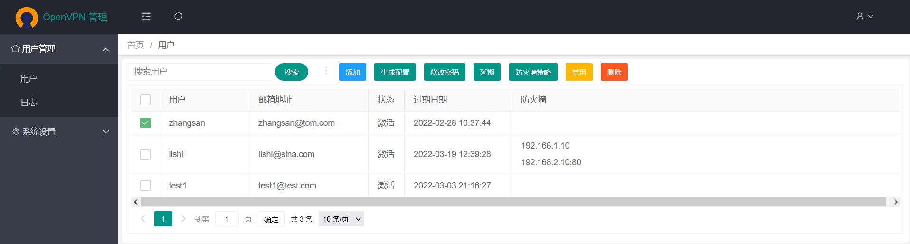

# openvpn_web

#### 介绍
OpenVPN简单的用户管理与用户登陆日志系统

#### 更新说明

1. 只支持python3版本，不再支持python2
2. 添加邮箱提醒功能：提醒用户到期时间
3. 添加两个与邮箱功能相关的表t_smtp, t_warn
4. 用户表t_user添加2个字段email, send
5. 前端做了较大的变动，增加与邮箱提醒相关的功能

#### 部署文档
参见：https://my.oschina.net/u/3021599/blog/3048615

